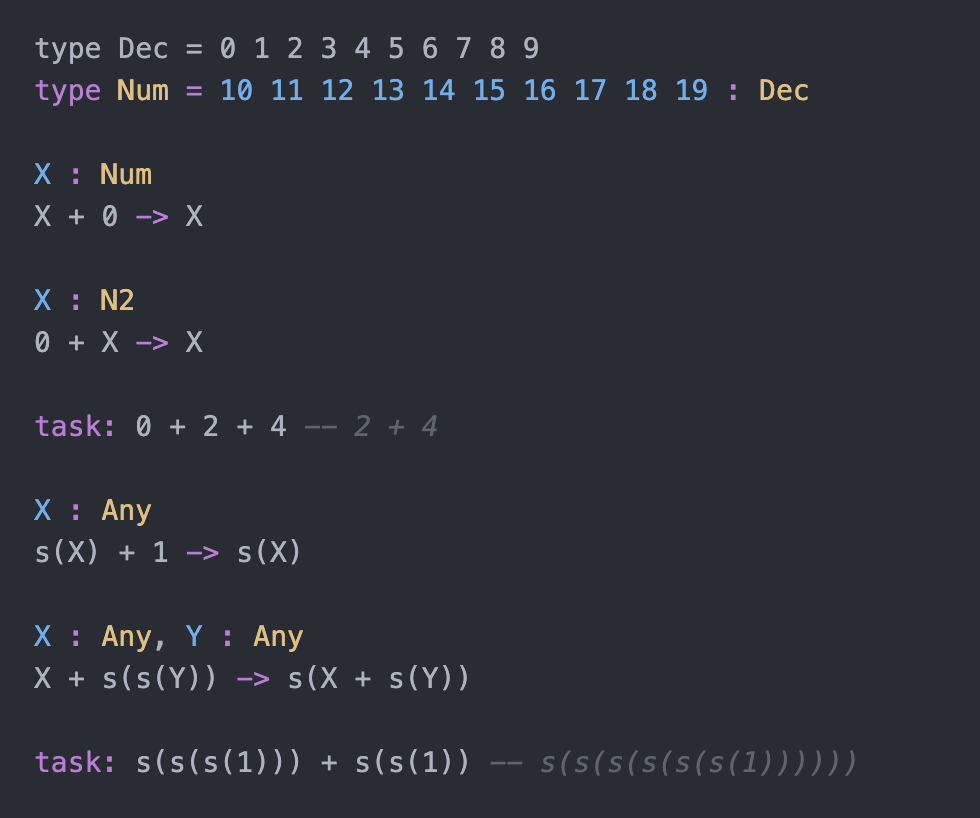

# Saturn syntax support for Atom and Pulsar

Adds syntax highlighting to Saturn programming language files in Atom and Pulsar editors.

More details about Saturn and it's syntax
in [Saturn repository](https://github.com/phyalexander/Saturn.git)

# Contributing

Would be glad to receive any help in improving this package.

# License

Copyright (c) 2024 phyalexander.

See the [LICENSE.md](./LICENSE.md) for details.
